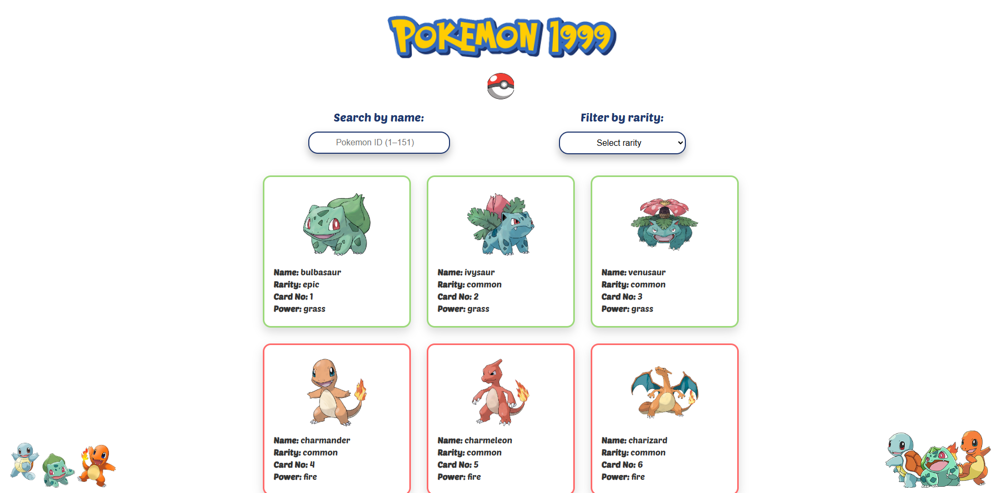

# 🎮 Pokémon Debounce Search

A fast and interactive Pokémon search application featuring debounce optimization, real-time API fetching, and a beautiful responsive card layout. Browse through the original 151 Pokémon with smooth search and filter capabilities.


## 📸 Screenshot



## ✨ Features

- **⚡ Debounced Search**: Optimized search input with debounce to reduce API calls and improve performance
- **🔍 Real-time Filtering**: Search Pokémon by ID (1-151) with instant results
- **🎲 Rarity System**: Filter Pokémon by rarity tiers (Common, Rare, Epic, Legendary)
- **📄 Pagination**: Browse through Pokémon with smooth pagination (12 cards per page)
- **🎨 Type-based Colors**: Dynamic card colors based on Pokémon type
- **📱 Responsive Design**: Fully responsive layout that works on all devices
- **🖼️ High-Quality Artwork**: Uses official Pokémon artwork from PokéAPI

## 🚀 Demo

Simply open `index.html` in your browser to start exploring!

## 🛠️ Technologies Used

- **Vanilla JavaScript (ES6+)**: No frameworks, pure JavaScript for maximum performance
- **PokéAPI**: RESTful Pokémon API for fetching Pokémon data
- **CSS Grid**: Modern layout system for responsive card grid
- **Google Fonts**: Poetsen One font for authentic Pokémon styling

## 📋 How It Works

### Debounce Implementation

The search functionality uses a debounce technique to optimize performance:

```javascript
// Waits 300ms after user stops typing before executing search
searchInput.addEventListener("input", debounce(handleSearch, 300));
```

### Data Fetching

- Fetches all 151 original Pokémon from PokéAPI on initial load
- Stores data locally to avoid repeated API calls
- Displays high-quality official artwork for each Pokémon

### Filtering System

- **Search by ID**: Enter a Pokémon ID (1-151) to find specific Pokémon
- **Rarity Filter**: Choose from Common, Rare, Epic, or Legendary tiers
- Combines filters for precise results

## 📁 Project Structure

```
pokemon-debounce-search/
├── index.html          # Main HTML structure
├── style.css           # Styling and responsive design
├── script.js           # Core JavaScript logic
├── README.md           # Project documentation
└── assets/
    ├── fonts/          # Custom fonts
    └── images/         # Logo and UI images
```

## 🎯 Key Functions

- **`fetchPokemon()`**: Fetches all 151 Pokémon from the API
- **`debounce()`**: Implements debounce pattern for search optimization
- **`handleSearch()`**: Filters Pokémon based on search input
- **`filterByRarity()`**: Filters Pokémon by rarity tier
- **`renderPage()`**: Renders current page of Pokémon cards
- **`generateRarity()`**: Randomly assigns rarity to each Pokémon

## 🎨 Features Breakdown

### Debounce Optimization

Prevents excessive function calls during rapid user input, improving performance and reducing unnecessary re-renders.

### Pagination System

- Displays 12 Pokémon per page
- Dynamic page numbers based on filtered results
- Smooth navigation between pages

### Type Colors

Each Pokémon card is color-coded based on its primary type:

- Fire → Red
- Water → Blue
- Grass → Green
- Electric → Yellow
- And more...

## 🚦 Getting Started

1. **Clone the repository**

   ```bash
   git clone https://github.com/tolgab35/pokemon-debounce-search.git
   ```

2. **Navigate to the project directory**

   ```bash
   cd pokemon-debounce-search
   ```

3. **Open in browser**
   ```bash
   # Simply open index.html in your browser
   # Or use a local server:
   npx serve
   ```

## 💡 Usage

1. **Search**: Enter a Pokémon ID (1-151) in the search box
2. **Filter**: Select a rarity tier from the dropdown menu
3. **Browse**: Use pagination controls to navigate through pages
4. **Explore**: Click on cards to view Pokémon details

## 🔧 Customization

### Change Items Per Page

```javascript
const ITEMS_PER_PAGE = 12; // Modify this value in script.js
```

### Add More Pokémon

```javascript
// Change the loop limit in fetchPokemon()
for (let id = 1; id <= 151; id++) { // Change 151 to desired number
```

### Modify Type Colors

```javascript
// Edit typeColors object in script.js
const typeColors = {
  fire: "red",
  water: "blue",
  // Add or modify colors here
};
```

## 📊 API Reference

This project uses [PokéAPI](https://pokeapi.co/):

- Endpoint: `https://pokeapi.co/api/v2/pokemon/{id}`
- Returns comprehensive Pokémon data including sprites, types, and stats

## 🤝 Contributing

Contributions are welcome! Feel free to:

1. Fork the repository
2. Create a feature branch (`git checkout -b feature/AmazingFeature`)
3. Commit your changes (`git commit -m 'Add some AmazingFeature'`)
4. Push to the branch (`git push origin feature/AmazingFeature`)
5. Open a Pull Request

## 📝 License

This project is open source and available under the [MIT License](LICENSE).

## 🙏 Acknowledgments

- [PokéAPI](https://pokeapi.co/) for providing the Pokémon data
- Nintendo, Game Freak, and The Pokémon Company for creating Pokémon
- Google Fonts for the Poetsen One font

## 👨‍💻 Author

**Tolga**

- GitHub: [@tolgab35](https://github.com/tolgab35)

---

⭐ If you found this project helpful, please consider giving it a star!
